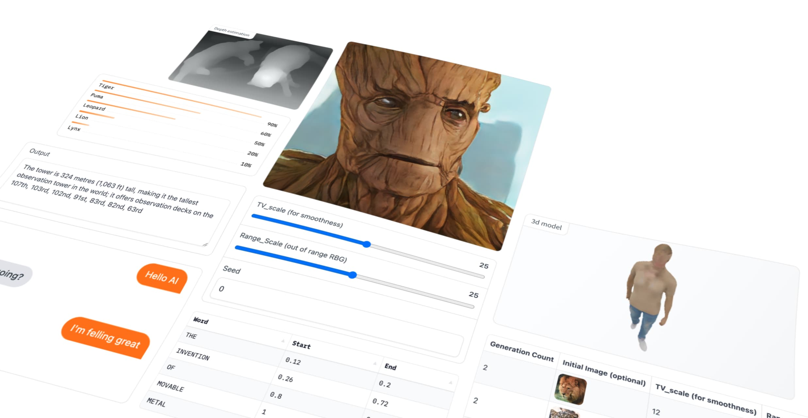
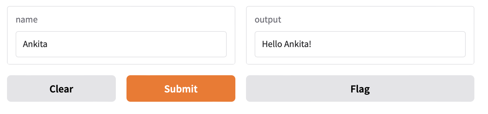
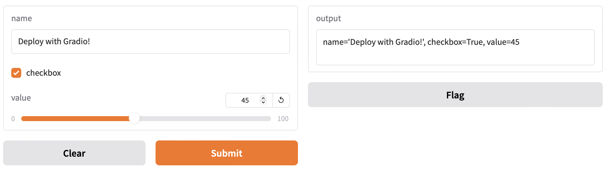
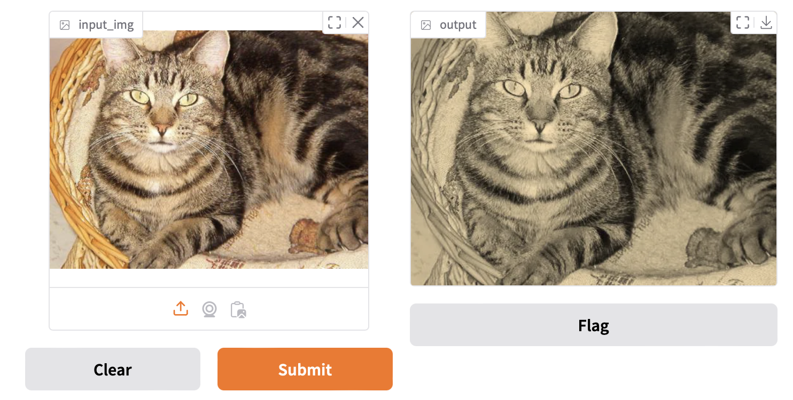
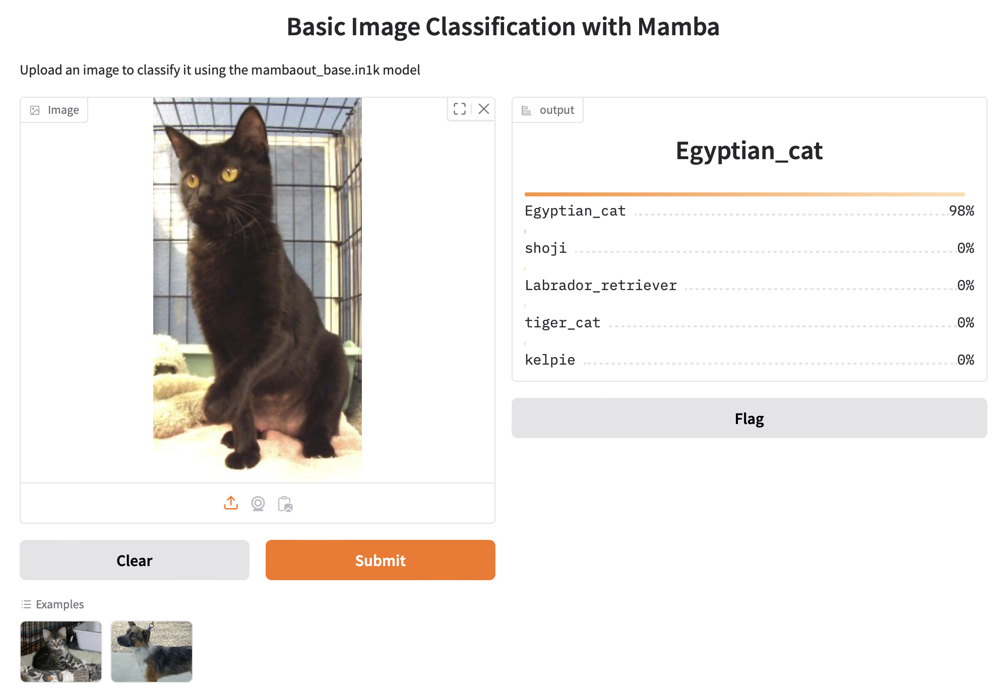
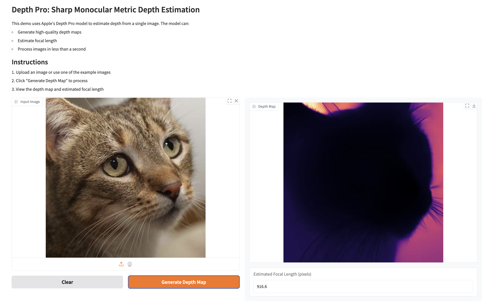
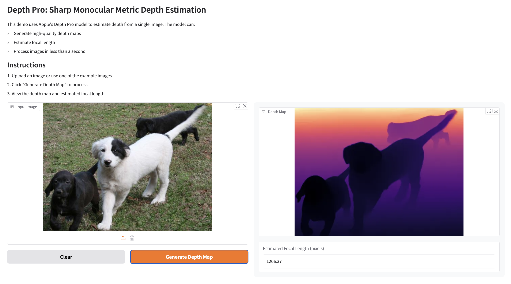
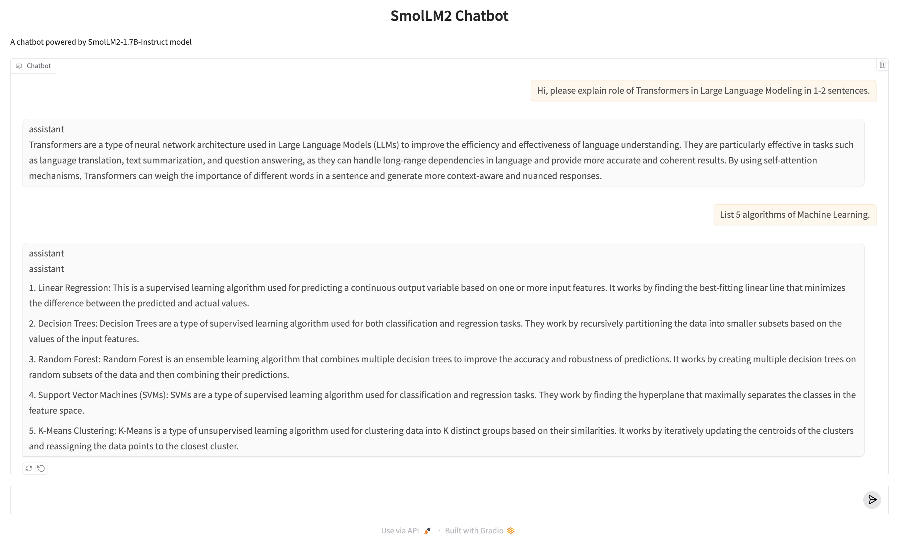
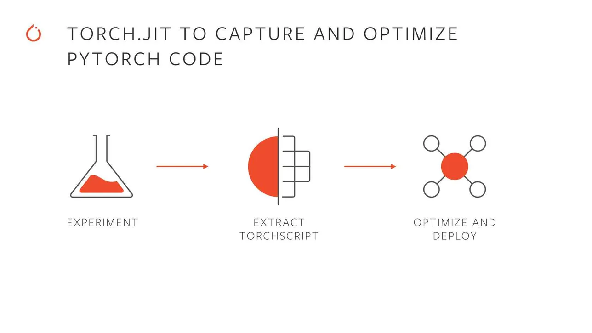
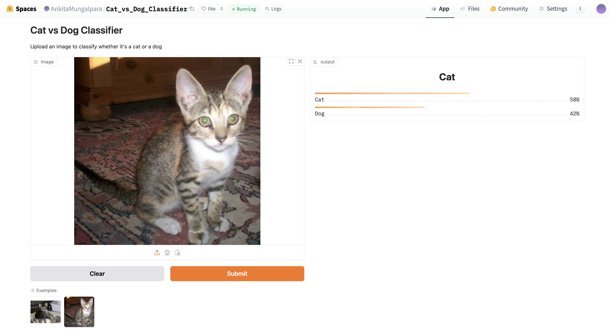

# Deployment with Gradio

## Topics Covered


- [Introduction to Gradio](#introduction-to-gradio)
  - [What is Gradio?](#what-is-gradio)
  - [Why Do We Need Gradio?](#why-do-we-need-gradio)
  - [Features of Gradio](#features-of-gradio)
  - [Examples](#examples)
    - [Example 1: Hello World with Gradio](#example-1-hello-world-with-gradio)
    - [Example 2: Multiple Inputs with Gradio](#example-2-multiple-inputs-with-gradio)
    - [Example 3: Interacting with a Gradio App via Client](#example-3-interacting-with-a-gradio-app-via-client)
    - [Example 4: Applying Filter to Images](#example-4-applying-filter-to-images)
    - [Example 5: Image Classification](#example-5-image-classification)
    - [Example 6: Batch Image Classification](#example-6-batch-image-classification)
    - [Example 7: Deploying Apple's Depth Pro Model using Gradio](#example-7-deploying-apples-depth-pro-model-using-gradio)
    - [Example 8: Deploying a Chatbot](#example-8-deploying-a-chatbot)
- [TorchScript: A PyTorch Serialization Framework](#torchscript-a-pytorch-serialization-framework)
  - [Why Use TorchScript?](#why-use-torchscript)
  - [How TorchScript Works?](#how-torchscript-works)
  - [Key Features](#key-features)
  - [Example: Annotating and Inspecting a Scripted Function](#example-annotating-and-inspecting-a-scripted-function)
  - [TorchScript: Script vs Tracing](#torchscript-script-vs-tracing)
  - [Comparison: Script vs. Trace](#comparison-script-vs-trace)
  - [Deployment of Deep Learning Classifier with Gradio](#deployment-of-deep-learning-classifier-with-gradio)
- [References](#references)


## Introduction to Gradio  



### What is Gradio?  
Gradio is an open-source Python library that makes it incredibly easy to build user-friendly web-based interfaces for machine learning models, APIs, or any Python function. With just a few lines of code, you can create interactive UIs that allow users to upload inputs, view model outputs, and share the interface through a simple web URL.  

### Why Do We Need Gradio?  

Gradio is useful for:  

1. **Rapid Prototyping**:  
   - Gradio allows developers and data scientists to quickly create functional interfaces to test and demonstrate their models.  

2. **Collaboration**:  
   - By providing a shareable web link, Gradio makes it easy to collect feedback from teammates, stakeholders, or end-users without requiring complex setups.  

3. **Ease of Use**:  
   - It requires minimal coding and setup, making it ideal for quickly showcasing models or functions.  

4. **Iterative Development**:  
   - Testing and gathering feedback early in the development process helps improve models and ensures they meet user requirements.  

5. **Accessibility**:  
   - With no need for front-end development skills, Gradio bridges the gap between data science and end-user interaction.  


### Features of Gradio  

1. **Interactive User Interfaces**:  
   - Supports text, image, audio, video, and tabular inputs and outputs.  
   - Allows dynamic interaction with models in real-time.  

2. **Shareable Web Links**:  
   - Automatically generates a shareable URL (`share=True`) to make your app accessible online.  

3. **Customizable**:  
   - Fully customizable interfaces with various input/output components and layouts.  

4. **Supports Various Use Cases**:  
   - Ideal for machine learning demos, data exploration, and tool development.  

5. **Fast Iterations**:  
   - Lightweight framework that allows you to build and test prototypes in minutes.  


### Examples  

#### Example 1: **Hello World with Gradio**  
**Code:**  
```python  
import gradio as gr

def greet(name):
    return "Hello " + name + "!"

demo = gr.Interface(fn=greet, inputs="textbox", outputs="textbox")
    
demo.launch(share=True)  # Share results with your friends with just 1 extra parameter 🚀
```  

**Result:**  
- Shareable via a public URL using `share=True`.  




#### Example 2: **Multiple Inputs with Gradio**  
**Code:**  
```python  
import gradio as gr

def test(name, checkbox, value):
    return f"{name=}, {checkbox=}, {value=}"

demo = gr.Interface(fn=test, inputs=[gr.Text(), gr.Checkbox(), gr.Slider(0, 100)], outputs=gr.Text())

demo.launch()
```  

**Result:**  
- Interface with three input components:  
  1. **Text**: Enter any string.  
  2. **Checkbox**: Toggle between `True` and `False`.  
  3. **Slider**: Select a value between 0 and 100.  




#### Example 3: **Interacting with a Gradio App via Client**  
**Code:**  
```python  
# pip install gradio_client

from gradio_client import Client

client = Client("http://localhost:7860")
result = client.predict(
    "John",  # str  in 'name' Textbox component
    True,  # bool  in 'checkbox' Checkbox component
    # int | float (numeric value between 0 and 100) in 'value' Slider component
    0,
    api_name="/predict"
)
print(result)
```  

**Result:**  
- Demonstrates how to interact with a Gradio app programmatically using the **Gradio Client**.  
- Sends inputs to the app running at `http://localhost:7860`.  

```bash
Loaded as API: http://localhost:7860/ ✔
name='John', checkbox=True, value=0

```

#### Example 4: **Applying Filter to Images**  

**Code:**  
```python  
import numpy as np  
import gradio as gr  

def sepia(input_img, request: gr.Request):  
    print("Request headers dictionary:", request.headers)  
    print("IP address:", request.client.host)  
    print(f"{type(input_img)=}")  
    sepia_filter = np.array([  
        [0.393, 0.769, 0.189],  
        [0.349, 0.686, 0.168],  
        [0.272, 0.534, 0.131]  
    ])  
    sepia_img = input_img.dot(sepia_filter.T)  
    sepia_img /= sepia_img.max()  
    return sepia_img  

demo = gr.Interface(  
    fn=sepia,  
    inputs=gr.Image(height=300, width=300),  
    outputs="image"  
)  
demo.launch(share=True)  
```  

**Result:**  



#### Example 5: **Image Classification**  

**Code:**  
```python  
import gradio as gr  
import torch  
import timm  
from PIL import Image  
import requests  

class ImageClassifier:  
    def __init__(self):  
        self.device = torch.device('cuda' if torch.cuda.is_available() else 'cpu')  
        # Create model and move to appropriate device  
        self.model = timm.create_model('mambaout_base.in1k', pretrained=True)  
        self.model = self.model.to(self.device)  
        self.model.eval()  

        # Get model-specific transforms  
        data_config = timm.data.resolve_model_data_config(self.model)  
        self.transform = timm.data.create_transform(**data_config, is_training=False)  

        # Load ImageNet labels  
        url = 'https://storage.googleapis.com/bit_models/ilsvrc2012_wordnet_lemmas.txt'  
        self.labels = requests.get(url).text.strip().split('\n')  

    @torch.no_grad()  
    def predict(self, image):  
        if image is None:  
            return None  
        
        # Preprocess image  
        img = Image.fromarray(image).convert('RGB')  
        img_tensor = self.transform(img).unsqueeze(0).to(self.device)  
        
        # Get prediction  
        output = self.model(img_tensor)  
        probabilities = torch.nn.functional.softmax(output[0], dim=0)  
        
        # Get top 5 predictions  
        top5_prob, top5_catid = torch.topk(probabilities, 5)  
        
        return {  
            self.labels[idx.item()]: float(prob)  
            for prob, idx in zip(top5_prob, top5_catid)  
        }  

# Create classifier instance  
classifier = ImageClassifier()  

# Create Gradio interface  
demo = gr.Interface(  
    fn=classifier.predict,  
    inputs=gr.Image(),  
    outputs=gr.Label(num_top_classes=5),  
    title="Basic Image Classification with Mamba",  
    description="Upload an image to classify it using the mambaout_base.in1k model",  
    examples=[  
        ["examples/cat.jpg"],  
        ["examples/dog.jpg"]  
    ]  
)  

if __name__ == "__main__":  
    demo.launch()  
```  

**Result:**  
- **Input:** Upload an image (e.g., a cat or dog photo).  
- **Output:** The model predicts the top 5 labels with their respective probabilities based on ImageNet classes.  

Output displays the top 5 predictions with probabilities as shown in below example:  



#### Example 6: **Batch Image Classification**  

This example demonstrates how to perform **batch image classification** using the `mambaout_base.in1k` model. It supports multiple concurrent image preprocessing, inference, and result generation.  

##### **Server**  

```python  
import gradio as gr  
import torch  
import timm  
from PIL import Image  
import numpy as np  

class ImageClassifier:  
    def __init__(self):  
        self.device = torch.device('cuda' if torch.cuda.is_available() else 'cpu')  
        self.model = timm.create_model('mambaout_base.in1k', pretrained=True)  
        self.model = self.model.to(self.device)  
        self.model.eval()  
        
        # Set up data transforms and labels  
        data_config = timm.data.resolve_model_data_config(self.model)  
        self.transform = timm.data.create_transform(**data_config, is_training=False)  
        
        import requests  
        url = 'https://storage.googleapis.com/bit_models/ilsvrc2012_wordnet_lemmas.txt'  
        self.labels = requests.get(url).text.strip().split('\n')  
    
    @torch.no_grad()  
    def predict_batch(self, image_list, progress=gr.Progress(track_tqdm=True)):  
        if isinstance(image_list, tuple) and len(image_list) == 1:  
            image_list = [image_list[0]]  
            
        if not image_list or image_list[0] is None:  
            return [[{"none": 1.0}]]  
            
        progress(0.1, desc="Starting preprocessing...")  
        tensors = []  
        
        # Process each image in the batch  
        for image in image_list:  
            if image is None:  
                continue  
            img = Image.fromarray(image).convert('RGB')  
            tensor = self.transform(img)  
            tensors.append(tensor)  
            
        if not tensors:  
            return [[{"none": 1.0}]]  
            
        progress(0.4, desc="Batching tensors...")  
        batch = torch.stack(tensors).to(self.device)  
        
        progress(0.6, desc="Running inference...")  
        outputs = self.model(batch)  
        probabilities = torch.nn.functional.softmax(outputs, dim=1)  
        
        progress(0.8, desc="Processing results...")  
        batch_results = []  
        for probs in probabilities:  
            top5_prob, top5_catid = torch.topk(probs, 5)  
            result = {  
                self.labels[idx.item()]: float(prob)  
                for prob, idx in zip(top5_prob, top5_catid)  
            }  
            batch_results.append(result)  
        
        progress(1.0, desc="Done!")  
        return [batch_results]  

# Create classifier instance  
classifier = ImageClassifier()  

# Create Gradio interface  
demo = gr.Interface(  
    fn=classifier.predict_batch,  
    inputs=gr.Image(),  
    outputs=gr.Label(num_top_classes=5),  
    title="Advanced Image Classification with Mamba",  
    description="Upload images for batch classification with the mambaout_base.in1k model",  
    batch=True,  
    max_batch_size=4  
)  

if __name__ == "__main__":  
    demo.launch()  
```  

##### **Client**  

```python  
from gradio_client import Client, handle_file  
import concurrent.futures  
import time  

def make_prediction(client, image_url):  
    """Make a single prediction"""  
    try:  
        result = client.predict(  
            image_list=handle_file(image_url),  
            api_name="/predict"  
        )  
        return result  
    except Exception as e:  
        return f"Error: {str(e)}"  

def main():  
    # Test image URL  
    image_url = "https://raw.githubusercontent.com/gradio-app/gradio/main/test/test_files/bus.png"  
    
    # Initialize client  
    client = Client("http://127.0.0.1:7860/")  
    
    print("\nSending 16 concurrent requests with the same image...")  
    start_time = time.time()  
    
    # Send concurrent requests  
    with concurrent.futures.ThreadPoolExecutor(max_workers=16) as executor:  
        futures = [  
            executor.submit(make_prediction, client, image_url)  
            for _ in range(16)  
        ]  
        
        results = []  
        for i, future in enumerate(concurrent.futures.as_completed(futures)):  
            try:  
                result = future.result()  
                results.append(result)  
                print(f"Completed prediction {i+1}/16")  
            except Exception as e:  
                print(f"Error in request {i+1}: {str(e)}")  
    
    end_time = time.time()  
    
    # Print results  
    print(f"\nAll predictions completed in {end_time - start_time:.2f} seconds")  
    print("\nResults:")  
    for i, result in enumerate(results):  
        print(f"\nRequest {i+1}:")  
        print(result)  

if __name__ == "__main__":  
    main()  
```  

---

#### Result:  

Each image returns the top 5 predicted labels with probabilities from the ImageNet dataset.  


#### Example Workflow  

1. **Server Side:**  
   - Launch the Gradio app.  
   - Upload a batch of images (e.g., buses, cats, dogs, etc.).  
   - View top-5 predictions for each image along with progress updates.  

2. **Client Side:**  
   - Sends multiple concurrent requests to the Gradio server using `gradio_client`.  
   - Receives predictions and logs them to the console.  

**Example Prediction (Server Output):**  

For a bus image:  
```json  
{
   "label":"minibus",
   "confidences":[
      {
         "label":"minibus",
         "confidence":0.571755051612854
      },
      {
         "label":"vacuum, vacuum_cleaner",
         "confidence":0.07250463962554932
      },
      {
         "label":"passenger_car, coach, carriage",
         "confidence":0.05805877596139908
      },
      {
         "label":"trolleybus, trolley_coach, trackless_trolley",
         "confidence":0.03005979023873806
      },
      {
         "label":"school_bus",
         "confidence":0.005981458351016045
      }
   ]
} 
```  

#### Example 7: **Deploying Apple's Depth Pro Model using Gradio**  

This example demonstrates deploying **Depth Pro model** for **monocular metric depth estimation**. The model processes an input image to generate a depth map and estimate focal length in pixels.  

To run the **Depth Pro** model, you need to first set up the required dependencies and download the pre-trained weights.


#### **download_weights.sh**  
Run below script as it creates a directory named **checkpoints** and downloads the pre-trained weights for the **Depth Pro** model.  

```bash  
#!/bin/bash  
mkdir -p checkpoints  
wget https://ml-site.cdn-apple.com/models/depth-pro/depth_pro.pt -P checkpoints  
```  


#### **requirements.txt**  
Install the dependencies with the following command:  

```bash  
pip install git+https://github.com/apple/ml-depth-pro.git  
```  

Once the weights and dependencies are set up, we're ready to deploy and run the **Depth Pro** application.


#### **Server**  

```python  
import depth_pro  
import gradio as gr  
import matplotlib.cm as cm  
import numpy as np  
from depth_pro.depth_pro import DepthProConfig  
from PIL import Image  
import torch  

# CSS for better styling - simplified  
CUSTOM_CSS = """  
.output-panel {  
    padding: 15px;  
    border-radius: 8px;  
    background-color: #f8f9fa;  
}  
"""  

DESCRIPTION = """  
# Depth Pro: Sharp Monocular Metric Depth Estimation  

This demo uses Apple's Depth Pro model to estimate depth from a single image. The model can:  
- Generate high-quality depth maps  
- Estimate focal length  
- Process images in less than a second  

## Instructions  
1. Upload an image or use one of the example images  
2. Click "Generate Depth Map" to process  
3. View the depth map and estimated focal length  
"""  

class DepthEstimator:  
    def __init__(self):  
        self.device = torch.device('cuda' if torch.cuda.is_available() else 'cpu')  
        self.config = DepthProConfig(  
            patch_encoder_preset="dinov2l16_384",  
            image_encoder_preset="dinov2l16_384",  
            checkpoint_uri="./checkpoints/depth_pro.pt",  
            decoder_features=256,  
            use_fov_head=True,  
            fov_encoder_preset="dinov2l16_384",  
        )  
        self.model, self.transform = depth_pro.create_model_and_transforms(config=self.config)  
        self.model.eval()  
        self.model.to(self.device)  

    def process_image(self, input_image_path, progress=gr.Progress()):  
        if input_image_path is None:  
            return None, None  

        progress(0.2, "Loading image...")  
        image, _, f_px = depth_pro.load_rgb(input_image_path)  
        
        progress(0.4, "Preprocessing...")  
        image = self.transform(image)  
        image = image.to(self.device)  
        
        progress(0.6, "Generating depth map...")  
        with torch.no_grad():  
            prediction = self.model.infer(image, f_px=f_px)  

        progress(0.8, "Post-processing...")  
        depth_map = prediction["depth"].squeeze().cpu().numpy()  
        focallength_px = prediction["focallength_px"]  

        # Normalize and colorize depth map  
        depth_map = (depth_map - depth_map.min()) / (depth_map.max() - depth_map.min())  
        colormap = cm.get_cmap("magma")  
        depth_map = colormap(depth_map)  
        depth_map = (depth_map[:, :, :3] * 255).astype(np.uint8)  
        depth_map = Image.fromarray(depth_map)  

        progress(1.0, "Done!")  
        return depth_map, float(focallength_px.item())  

def create_demo():  
    estimator = DepthEstimator()  
    
    with gr.Blocks(css=CUSTOM_CSS) as demo:  
        gr.Markdown(DESCRIPTION)  
        
        with gr.Row():  
            with gr.Column(scale=1):  
                input_image = gr.Image(  
                    label="Input Image",  
                    type="filepath",  
                    sources=["upload", "webcam"]  
                )  
                
                with gr.Row():  
                    clear_btn = gr.Button("Clear", variant="secondary")  
                    submit_btn = gr.Button("Generate Depth Map", variant="primary")  
                
            with gr.Column(scale=1, elem_classes=["output-panel"]):  
                output_depth_map = gr.Image(  
                    label="Depth Map",  
                    show_label=True  
                )  
                output_focal_length = gr.Number(  
                    label="Estimated Focal Length (pixels)",  
                    precision=2  
                )  
        
        # Event handlers  
        submit_btn.click(  
            fn=estimator.process_image,  
            inputs=[input_image],  
            outputs=[output_depth_map, output_focal_length]  
        )  
        
        clear_btn.click(  
            fn=lambda: (None, None, None),  
            inputs=[],  
            outputs=[input_image, output_depth_map, output_focal_length]  
        )  
        
    return demo  

if __name__ == "__main__":  
    demo = create_demo()  
    demo.launch(  
        share=True,  
        show_error=True  
    )  
```  


#### Result:  

##### Example Prediction 1 

For an input image:  

- **Depth Map**:  
     

- **Focal Length**:  
   ```
   Estimated Focal Length: 916.6 pixels
   ```  


##### Example Prediction 2

For an input image:  

- **Depth Map**:  
     

- **Focal Length**:  
   ```
   Estimated Focal Length: 1206.37 pixels
   ```  

#### Example 8: **Deploying a Chatbot**  

Below is an example of deploying a chatbot using **Gradio** and the **SmolLM2-1.7B-Instruct** model from Hugging Face.  

##### **Key Steps**  

1. **Model Loading**:  
   - The **AutoTokenizer** and **AutoModelForCausalLM** are used to load the tokenizer and the SmolLM2 model, optimized for CUDA.  

2. **Chat Response Function**:  
   - Handles incoming user messages and chat history.  
   - Converts the messages into a format the model understands and streams the generated responses.  

3. **Streaming**:  
   - The chatbot streams responses token by token for a real-time conversational feel.  


##### **chatbot.py**  

```python
import gradio as gr
from transformers import AutoModelForCausalLM, AutoTokenizer, TextIteratorStreamer
import torch
from threading import Thread

# Load model and tokenizer
checkpoint = "HuggingFaceTB/SmolLM2-1.7B-Instruct"
device = "cuda"
tokenizer = AutoTokenizer.from_pretrained(checkpoint)
model = AutoModelForCausalLM.from_pretrained(checkpoint, device_map="auto")

def chat_response(message, history):
    print(f"Received message: {message}")
    print(f"History: {history}")
    
    messages = []
    for h in history:
        messages.append(h)  # Each h is already a dict with 'role' and 'content'
    messages.append({"role": "user", "content": message})
    
    # Generate response
    input_text = tokenizer.apply_chat_template(messages, tokenize=False)
    inputs = tokenizer.encode(input_text, return_tensors="pt").to(device)
    
    # Setup streamer
    streamer = TextIteratorStreamer(tokenizer, timeout=10., skip_prompt=True, skip_special_tokens=True)
    
    # Generate with streaming
    generation_kwargs = dict(
        inputs=inputs,
        max_new_tokens=256,
        temperature=0.2,
        top_p=0.9,
        do_sample=True,
        pad_token_id=tokenizer.eos_token_id,
        streamer=streamer
    )
    
    # Create a thread to run the generation
    thread = Thread(target=model.generate, kwargs=generation_kwargs)
    thread.start()
    
    # Stream the response
    partial_message = ""
    for new_token in streamer:
        partial_message += new_token
        yield partial_message

# Create and launch the Gradio interface
demo = gr.ChatInterface(
    fn=chat_response,
    type="messages",
    title="SmolLM2 Chatbot",
    description="A chatbot powered by SmolLM2-1.7B-Instruct model",
    examples=[
        "What is the capital of France?",
        "How does photosynthesis work?",
        "Write a short poem about autumn."
    ],
    cache_examples=True
)

if __name__ == "__main__":
    demo.launch()
```  

#### Result:  




## **TorchScript: A PyTorch Serialization Framework**



Credit: 


TorchScript is a feature of PyTorch that enables you to serialize and optimize models for deployment. It transforms PyTorch models into a statically-typed intermediate representation that can be saved and executed in environments without Python, such as C++-based production systems.


### **Why Use TorchScript?**  
1. **Portability**:  
   - TorchScript models can run in environments where Python is unavailable, making it ideal for deployment in production settings.  

2. **Performance Optimization**:  
   - Models can be optimized for faster inference by utilizing JIT (Just-In-Time) compilation and other optimizations.  

3. **Cross-Platform Deployment**:  
   - TorchScript supports running on diverse platforms, such as mobile devices, servers, and embedded systems.  

4. **Debugging and Profiling**:  
   - Offers better insights into model performance through tools like TorchServe and TensorBoard.


### **How TorchScript Works?**  

TorchScript creates a statically-typed subset of Python using two methods:  

1. **Scripting**:  
   - Converts Python code into TorchScript by directly annotating it with **@torch.jit.script**.  

2. **Tracing**:  
   - Records the operations performed on tensors while running the model and generates a TorchScript graph.  


### **Key Features**  

1. TorchScript models can be saved using **torch.jit.save** and later loaded with **torch.jit.load**.  

2. TorchScript models run independently of Python, ideal for environments like C++ or mobile runtimes.  

3. TorchScript enforces type-checking, making the models more robust and predictable during runtime.  


### **Example: Annotating and Inspecting a Scripted Function**


Below is an example that demonstrates using TorchScript to script a function, inspect its computation graph, and execute it.


```python
import torch

# Define a simple function to manipulate tensors
def add(x: torch.Tensor):
    # Increment the tensor in-place by 2.0
    x += 2.0
    
    # Create a tensor of ones with the same shape as x
    y = torch.ones_like(x)
    
    # Add y to x and store the result in x
    x = x + y
    
    # Return the sum of all elements in x
    return torch.sum(x)

# Convert the function into TorchScript using scripting
scripted = torch.jit.script(add)

# Print the TorchScript computation graph
print("Computation Graph of the Scripted Function:")
print(scripted.graph)

# Test the scripted function with a random input tensor
input_tensor = torch.randn(1, 2)
print("\nInput Tensor:")
print(input_tensor)

output = scripted(input_tensor)
print("\nOutput of the Scripted Function:")
print(output)
```


### **Result**

```bash
Computation Graph of the Scripted Function:
graph(%x.1 : Tensor):
  %6 : NoneType = prim::Constant()
  %3 : int = prim::Constant[value=1]()
  %2 : float = prim::Constant[value=2.]() 
  %x.5 : Tensor = aten::add_(%x.1, %2, %3) 
  %y.1 : Tensor = aten::ones_like(%x.5, %6, %6, %6, %6, %6) 
  %x.11 : Tensor = aten::add(%x.5, %y.1, %3)
  %18 : Tensor = aten::sum(%x.11, %6)
  return (%18)


Input Tensor:
tensor([[0.1471, 0.4504]])

Output of the Scripted Function:
tensor(6.5975)
```

##### **TorchScript: Script vs Tracing**

TorchScript offers two primary methods to export PyTorch models for optimization and deployment: **Tracing** and **Scripting**. Each method has specific use cases and characteristics, which are outlined below:

#### **1. Tracing**  
Tracing records the operations executed by the model when it is run with specific input data. The resulting computation graph represents only the operations that were used during the trace.

##### **Key Characteristics:**
- **Export API**: **torch.jit.trace(model, input)**
- **How it works**:  
  - Runs the model with dummy inputs.  
  - Records the executed tensor operations to build a computation graph.


#### **2. Scripting**  
Scripting directly compiles the Python source code of a model into a computation graph. It captures both tensor operations and full Python control flow, resulting in a more flexible and accurate representation of the model.

##### **Key Characteristics:**
- **Export API**: **torch.jit.script(model)**
- **How it works**:  
  - Parses the model's Python code to create a graph representation of both operations and control logic.  
  - Includes all conditional statements (**if**, **for**, etc.) as part of the graph.  


### **Comparison: Script vs. Trace**

<table border="1" style="border-collapse: collapse; width: 100%;">
    <thead>
        <tr>
            <th>Feature</th>
            <th>Tracing</th>
            <th>Scripting</th>
        </tr>
    </thead>
    <tbody>
        <tr>
            <td><strong>API</strong></td>
            <td><code>torch.jit.trace(model, input)</code></td>
            <td><code>torch.jit.script(model)</code></td>
        </tr>
        <tr>
            <td><strong>Handles Conditional Logic</strong></td>
            <td>❌ Ignored; only follows the traced path</td>
            <td>✅ Captures all control flow</td>
        </tr>
        <tr>
            <td><strong>Input Dependency</strong></td>
            <td>Input-dependent; limited to traced path</td>
            <td>Input-independent; models full logic</td>
        </tr>
        <tr>
            <td><strong>Use Cases</strong></td>
            <td>Static graphs (e.g., CNNs)</td>
            <td>Dynamic models (e.g., RNNs, LSTMs)</td>
        </tr>
        <tr>
            <td><strong>Ease of Use</strong></td>
            <td>Simple; just provide input examples</td>
            <td>Requires annotating dynamic logic</td>
        </tr>
    </tbody>
</table>


### **Deployment of Deep Learning Classifier with Gradio**

Below are the steps and code snippets for deploying a **Classification** model using TorchScript and Gradio:


#### **1. Trace and Save the Model**
The **src/script.py** script demonstrates how to trace a PyTorch model and save it as a TorchScript model.

```python
import os
from pathlib import Path
import logging
import hydra
from omegaconf import DictConfig
import torch
import rootutils

root = rootutils.setup_root(__file__, indicator=".project-root", pythonpath=True)
log = logging.getLogger(__name__)

@hydra.main(version_base="1.3", config_path="../configs", config_name="train")
def main(cfg: DictConfig) -> None:
    log.info(f"Instantiating model <{cfg.model._target_}>")
    model = hydra.utils.instantiate(cfg.model)
    
    if cfg.get("ckpt_path"):
        log.info(f"Loading checkpoint: {cfg.ckpt_path}")
        checkpoint = torch.load(cfg.ckpt_path)
        model.load_state_dict(checkpoint['state_dict'])
    
    model.eval()
    example_input = torch.randn(1, 3, 160, 160)
    
    log.info("Tracing model...")
    traced_model = model.to_torchscript(method="trace", example_inputs=example_input)
    
    output_dir = Path("traced_models")
    output_dir.mkdir(exist_ok=True)
    output_path = output_dir / "model.pt"
    torch.jit.save(traced_model, output_path)
    log.info(f"Traced model saved to: {output_path}")

if __name__ == "__main__":
    main()
```

Run the script to generate the TorchScript model:

```bash
python src/script.py experiment=<experiment_name>
ckpt_path=</path/to/checkpoint/>
```


#### **2. Install Dependencies**

Requirements:

```bash
torch
gradio
torchvision
```

```bash
pip install -r requirements.txt
```


#### **3. Gradio Interface**
The **app.py** script sets up a Gradio-based web interface for the classifier.

```python
import gradio as gr
import torch
import torchvision.transforms as transforms
from PIL import Image

class CatDogClassifier:
    def __init__(self, model_path="model.pt"):
        self.device = torch.device('cuda' if torch.cuda.is_available() else 'cpu')
        self.model = torch.jit.load(model_path).to(self.device)
        self.model.eval()
        
        self.transform = transforms.Compose([
            transforms.Resize((160, 160)),
            transforms.ToTensor(),
            transforms.Normalize(
                mean=[0.485, 0.456, 0.406],
                std=[0.229, 0.224, 0.225]
            )
        ])
        self.labels = ['Dog', 'Cat']

    @torch.no_grad()
    def predict(self, image):
        if image is None:
            return None
        
        if not isinstance(image, Image.Image):
            image = Image.fromarray(image).convert('RGB')
        
        img_tensor = self.transform(image).unsqueeze(0).to(self.device)
        output = self.model(img_tensor)
        probabilities = torch.nn.functional.softmax(output[0], dim=0)
        
        return {
            self.labels[idx]: float(prob)
            for idx, prob in enumerate(probabilities)
        }

classifier = CatDogClassifier()

demo = gr.Interface(
    fn=classifier.predict,
    inputs=gr.Image(),
    outputs=gr.Label(num_top_classes=2),
    title="Cat vs Dog Classifier",
    description="Upload an image to classify whether it's a cat or a dog",
    examples=[
        ["examples/cat.jpg"],
        ["examples/dog.jpg"]
    ]
)

if __name__ == "__main__":
    demo.launch()
```

Run the Gradio app:

```bash
python app.py
```


#### **4. Deploy Gradio App**

To deploy the Gradio app publicly:
1. Add **demo.launch()** in **app.py**:

   ```python
   demo.launch(share=True)
   ```

2. Launch the app, and a public URL will be generated.

Alternatively, we can deploy the app to a cloud provider such as Hugging Face Spaces or AWS.


#### Directory Structure

```
gradio/
│
├── README.md                 
├── app.py                    # Gradio app script
├── model.pt                  # Traced TorchScript model
├── requirements.txt          # Dependencies 
├── examples/                 # Example images
│   ├── example1.jpg
│   ├── example2.jpg

```


#### Result:




## References

- 
- 
- 
- 
- 

